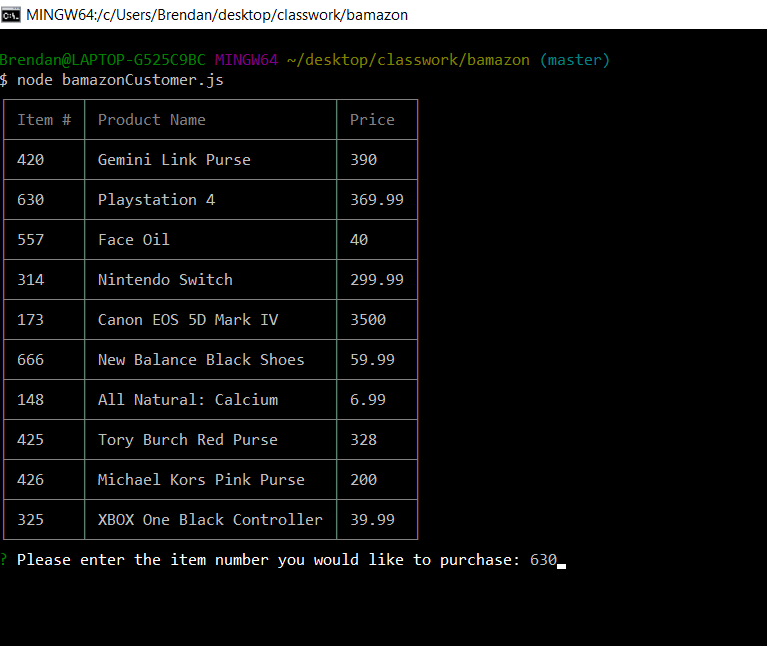
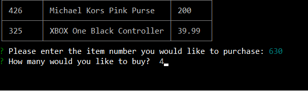
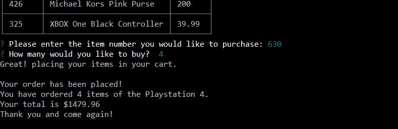

# BAMazon

### About
***

A virtual market place using MySQL, Javascript, and Node.JS where customers can pick a specific item from the given list and indicate what quantity of that item they would like to purchase.

#### BAMazon Customer
***

##### Step One

When you call the file bamazonCustomer.js in Node.JS, a table containing the data from MySQL should appear.  The table is generated by a npm (Node Package Manager.....or NO PEOPLE MATTER or Nightwing Plays Mahjong or Nobody Protects Me, etc.) called cli-table.  Under the table is the first question asking you to enter the product number of the item that you would like to purchase.

##### Step 2

If you answer a correct item id, it will move onto the next question asking you of what quantity of that item you would like to purchase.

##### Step 3

Finally, after you have entered in a quantity that is available for purchase, then will inform you that it has put the items into your cart and it will give you a grand total of all the items you would like to purchase.

#### Contributors:
***

Brendan Kellams [GitHub] (https://github.com/brendan-kellams)

#### Special Thanks:
***

Chris Stead [GitHub] (https://github.com/cmstead)
Ryan Hansen [GitHub] (https://github.com/rphansen91)
Greg Lee

#### Technologies Used:
***

* MySQL
* Node.JS
* Javascript
* npm packages:
	-[mysql] (https://www.npmjs.com/package/mysql)
	-[inquirer] (https://www.npmjs.com/package/inquirer)
	-[cli-table] (https://www.npmjs.com/package/cli-table)

#### License
***

Copyright 2016 UCSD Coding Bootcamp - Brendan Kellams

